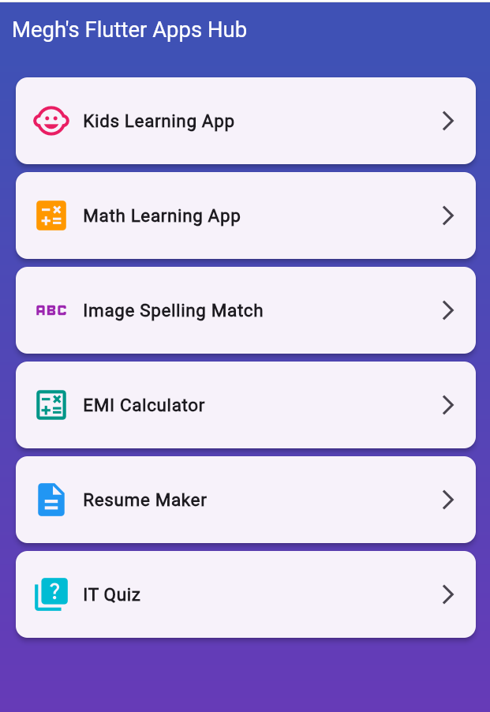

# 📱 Megh's Flutter Apps Hub

A comprehensive collection of educational and utility Flutter applications designed for learning and practical use. This project serves as a hub containing multiple mini-applications, each focusing on different aspects of mobile development and user functionality.



## 🚀 Features Overview

### 🎯 Hub Architecture
- **Centralized Navigation**: Single entry point to access all applications
- **Modular Design**: Each app is self-contained within its own folder
- **Scalable Structure**: Easy to add new applications to the collection
- **Professional UI**: Clean, modern interface with gradient backgrounds

## 📚 Applications Included

### 1. 👶 Kids Learning App
**Purpose**: Educational application for children
- Interactive learning modules
- Child-friendly interface design
- Educational content delivery
- **Location**: `lib/kids_learning_application/`

### 2. 🧮 Math Learning App
**Purpose**: Mathematics practice for children
- **Addition, Subtraction, Multiplication, Division** operations
- Dynamic question generation with appropriate difficulty levels
- Real-time score tracking
- Operation-specific color themes
- Interactive feedback system
- **Location**: `lib/math_learning_app/`

### 3. 🔤 Image Spelling Match
**Purpose**: Vocabulary and spelling enhancement
- **10 Different Questions** with emoji representations
- Multiple choice format (4 options per question)
- Visual feedback system (green for correct, red for incorrect)
- Progress tracking with completion percentage
- Randomized questions for replay value
- **Location**: `lib/image_spelling_match_app/`

### 4. 💰 EMI Calculator
**Purpose**: Financial calculation tool
- **Loan Amount, Interest Rate, Tenure** input fields
- Real-time EMI calculation using standard banking formula
- Professional financial interface
- Input validation and error handling
- **Formula**: `EMI = P × r × (1 + r)^n / ((1 + r)^n - 1)`
- **Location**: `lib/emi_calculator_app/`

### 5. 📄 Resume Maker
**Purpose**: Professional resume creation
- **Personal Information**: Name, Email, Phone
- **Skills Section**: Technical and soft skills input
- **Experience Section**: Professional background
- Live preview functionality
- Clean, professional resume format
- Edit and regenerate capabilities
- **Location**: `lib/resume_maker_app/`

### 6. 🧠 IT Quiz
**Purpose**: Programming knowledge assessment
- **Programming Subject Focus**
- **3 Comprehensive Questions**:
  - Web development languages
  - Object-Oriented Programming concepts
  - HTML fundamentals
- Multiple choice format with instant feedback
- Score tracking and completion statistics
- **Location**: `lib/it_quiz_app/`

## 🏗️ Project Structure

```
flutter_apps/
├── lib/
│   ├── main.dart                           # Main hub screen with navigation
│   ├── emi_calculator_app/
│   │   └── emi_calculator_screen.dart      # EMI calculation functionality
│   ├── image_spelling_match_app/
│   │   └── image_spelling_match_screen.dart # Image-spelling matching game
│   ├── it_quiz_app/
│   │   └── it_quiz_screen.dart             # Programming quiz application
│   ├── kids_learning_application/
│   │   └── screens/                        # Kids learning modules
│   ├── math_learning_app/
│   │   └── math_learning_screen.dart       # Math practice application
│   └── resume_maker_app/
│       └── resume_maker_screen.dart        # Resume creation tool
├── android/                               # Android-specific files
├── ios/                                   # iOS-specific files
├── web/                                   # Web-specific files
├── pubspec.yaml                           # Project dependencies
└── README.md                              # Project documentation
```

## 🛠️ Technical Implementation

### Core Technologies
- **Flutter Framework**: Cross-platform mobile development
- **Dart Language**: Primary programming language
- **Material Design**: Google's design system implementation
- **State Management**: StatefulWidget for reactive UI updates

### Key Features
- **Professional Architecture**: Modular, scalable code structure
- **Best Practices**: Clean code, proper state management, error handling
- **Responsive Design**: Adaptive layouts for different screen sizes
- **Industrial Standards**: Production-ready code quality

## 🚀 Getting Started

### Prerequisites
- Flutter SDK (latest stable version)
- Dart SDK (included with Flutter)
- Android Studio / VS Code
- Git for version control

### Installation Steps

1. **Clone the Repository**
   ```bash
   git clone https://github.com/meghpatel/flutter-apps-hub.git
   cd flutter-apps-hub
   ```

2. **Install Dependencies**
   ```bash
   flutter pub get
   ```

3. **Verify Flutter Installation**
   ```bash
   flutter doctor
   ```

4. **Run the Application**
   ```bash
   flutter run
   ```

### Platform-Specific Setup

#### Android
- Ensure Android SDK is installed
- Connect Android device or start emulator
- Run: `flutter run -d android`

#### iOS (macOS only)
- Install Xcode from App Store
- Set up iOS Simulator or connect iPhone
- Run: `flutter run -d ios`

#### Web
- Enable web support: `flutter config --enable-web`
- Run: `flutter run -d chrome`

### Development Environment
```bash
# Check Flutter version
flutter --version

# Analyze code quality
flutter analyze

# Run tests
flutter test

# Build for production
flutter build apk          # Android
flutter build ios          # iOS
flutter build web          # Web
```

## 📱 Usage Instructions

1. **Launch the App**: Start with the main hub screen
2. **Select Application**: Tap on any app card to navigate
3. **Follow Instructions**: Each app has intuitive interfaces
4. **Navigate Back**: Use device back button or app bar back arrow
5. **Restart**: Return to hub to switch between applications

## 🤝 Contributing

1. Fork the repository
2. Create a feature branch: `git checkout -b feature-name`
3. Commit changes: `git commit -m 'Add feature'`
4. Push to branch: `git push origin feature-name`
5. Submit a pull request

---

**Created with ❤️ by Megh Patel**

*This project demonstrates professional Flutter development practices and serves as a comprehensive learning resource for mobile application development.*